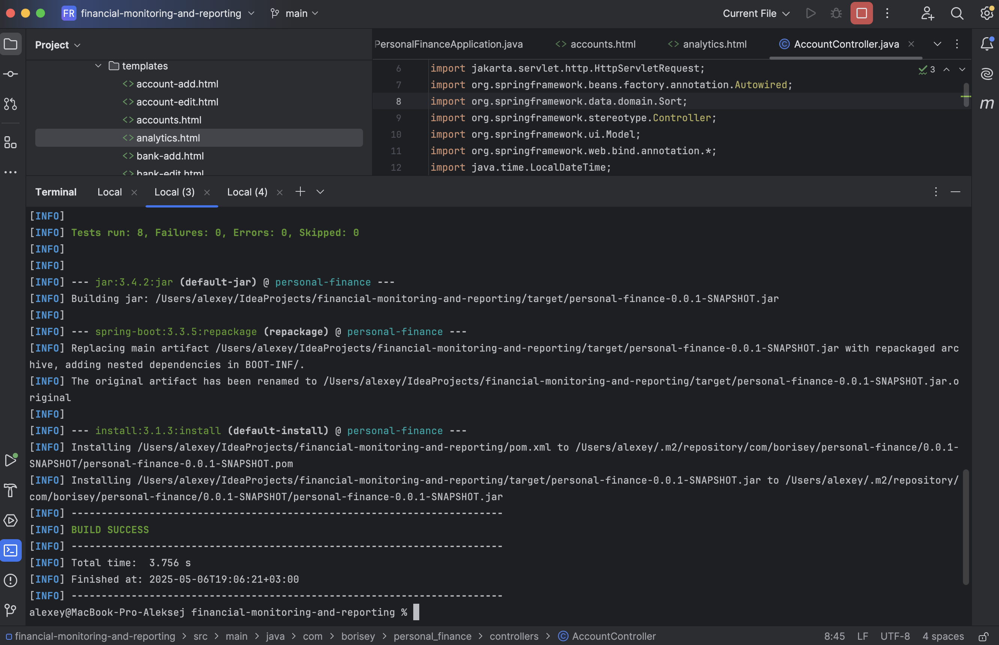

## Система финансового мониторинга и отчетности

### Быстрый старт

1. Создайте директорию проекта, например, `personal-finance`
2. Перейдите в директорию проекта в консоли и скопируйте репозиторий проекта в директорию проекта: выполните команду `git clone git@github.com:borisey/financial-monitoring-and-reporting ./`
3. Установите зависимости `Maven`. В консоли (в корневой директории проекта) выполните команду `mvn clean install`
4. Установите `MySQL` в `Docker-контейнере`: в консоли (в корневой директории проекта) выполните команду `docker-compose up`
5. Запустите приложение в IDE IDEA: откройте файл `/src/main/java/com/borisey/personal_finance/PersonalFinanceApplication.java` и выполните команду `RUN`
6. Откройте приложение в браузере `http://localhost:8080`
7. Зарегистрируйтесь в приложении (по ссылке: `http://localhost:8080/register`)
8. Авторизуйтесь в приложении, используя логин и пароль, указанные при регистрации
9. Создайте `счет` в `Дашборде` или в соответствующем разделе меню
10. Создайте `категорию дохода` в `Дашборде` или в соответствующем разделе меню
11. Создайте `категорию расхода` в `Дашборде` или в соответствующем разделе меню
12. Добавьте `доход` в `Дашборде` или в соответствующем разделе меню
13. Добавьте `расход` в `Дашборде` или в соответствующем разделе меню
14. Перейдите в раздел `Аналитика` для просмотра сводной информации о ваших личных финансах

### Итоговые артефакты демонстрации реализованного решения

#### 1. Реализованное веб-приложение

Локально приложение запускается по ссылке: http://localhost:8080

#### 2. Демонстрация работы с входными данными

#### 3. Отчеты о прохождении тестирования



#### 4. Архитектура

```
src/
├── main/
│   ├── java/
│   │   └── com/github/borisey/personal_finance/ ← базовый пакет проекта
│   │       ├── controller/                      ← веб-контроллеры (обработка HTTP-запросов)
│   │       ├── model/                           ← классы-сущности для JPA (User, Account, Category и др.)
│   │       ├── repository/                      ← интерфейсы Spring Data JPA для доступа к БД
│   │       ├── service/                         ← бизнес-логика приложения
│   │       └── config/                          ← конфигурационные классы (безопасность, интернационализация и пр.)
│   │
│   └── resources/
│       ├── application.properties               ← конфигурация Spring Boot приложения
│       ├── static/                              ← статические ресурсы (CSS, JS, изображения)
│       └── templates/                           ← Thymeleaf-шаблоны (HTML-страницы)
│
└── test/
    └── java/
        └── com/github/borisey/personal_finance/     ← тесты
 ```

#### 5. Диаграммы (бд, пользовательские)


#### 6. Техническая документация

##### Проект организован в соответствии с архитектурой MVC (Model-View-Controller), что обеспечивает разделение ответственности между различными компонентами:

•	Model (Модель): Содержит классы сущностей, представляющие таблицы базы данных, такие как User, Account, Category, Transaction, TransactionStatus и другие.

•	Repository (Репозиторий): Интерфейсы, расширяющие JpaRepository, обеспечивают доступ к данным и выполнение операций CRUD для соответствующих сущностей.

•	Service (Сервис): Содержит бизнес-логику приложения, включая обработку транзакций, валидацию данных и другие операции, связанные с бизнес-процессами.

•	Controller (Контроллер): Обрабатывает HTTP-запросы, взаимодействует с сервисами и возвращает соответствующие представления или данные.

•	View (Представление): Шаблоны HTML, с использованием шаблонизатора Thymeleaf, для отображения данных пользователю.

##### Основные компоненты

•	Пользователи: Регистрация, аутентификация и управление учетными записями пользователей.

•	Счета: Учет различных банковских счетов пользователя с возможностью отслеживания баланса.

•	Категории: Классификация доходов и расходов для более детального анализа финансов.

•	Транзакции: Запись финансовых операций с указанием суммы, даты, категории, счета и статуса.

•	Статусы транзакций: Определение состояния транзакции, например, “подтвержденная”, “в обработке”, “отменена”, “платеж выполнен”, “платеж удален”, “возврат”.

##### Особенности

•	Валидация доступа: Пользователи могут просматривать и изменять только свои собственные транзакции и счета.

•	Ограничения по статусам: Транзакции с определенными статусами (например, “подтвержденная”, “в обработке”, “отменена”, “платеж выполнен”, “платеж удален”, “возврат”) не допускаются к редактированию или удалению.

•	История изменений: Ведение истории обновлений транзакций с указанием времени последнего изменения.

•	Форматирование дат: Использование сервиса для форматирования дат в нужном формате.

##### Дополнительные компоненты

•	Банки: Информация о банках отправителя и получателя для каждой транзакции.

•	Типы лиц: Классификация участников транзакции, например, физическое или юридическое лицо.

•	ИНН и расчетные счета: Хранение информации о налоговом номере и расчетных счетах участников транзакции.

##### Технологии

•	Spring Boot

•	Spring Data JPA: Для взаимодействия с базой данных через ORM.

•	Thymeleaf: Шаблонизатор для создания динамических HTML-страниц.

•	Hibernate: Реализация JPA для управления персистентностью данных.

•	MySQL: Реляционная база данных для хранения информации.

#### 7. Unit-тесты

Unit-тесты доступны в директории `src/test/java/com/borisey/personal_finance`

#### 8. Выгрузка из БД

Выгрузка из БД доступна по [ссылке](https://github.com/borisey/financial-monitoring-and-reporting/blob/main/files/integrationlog.sql.gz)